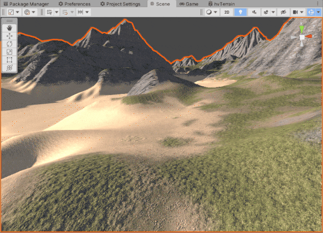
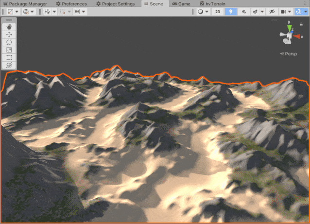
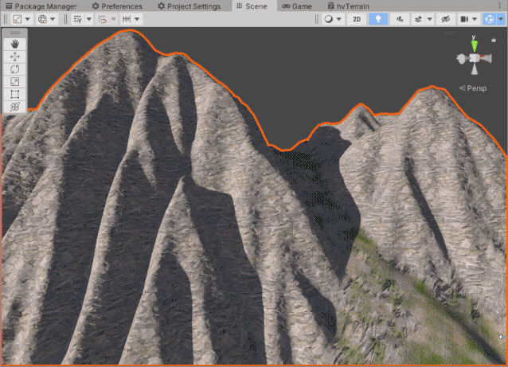
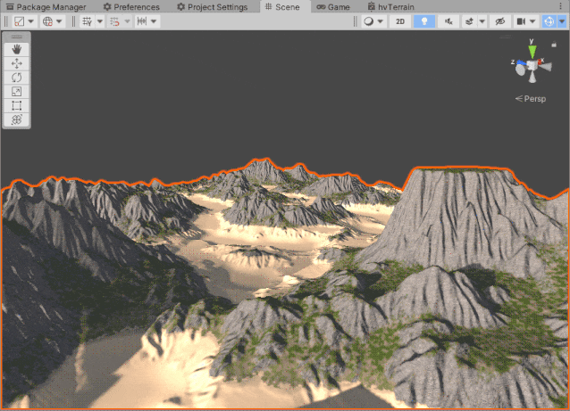
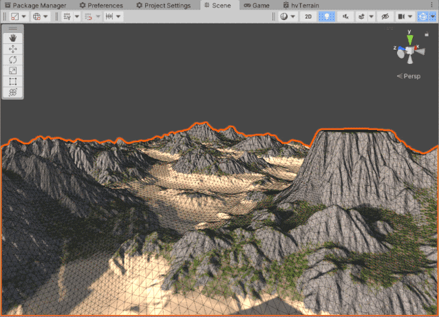
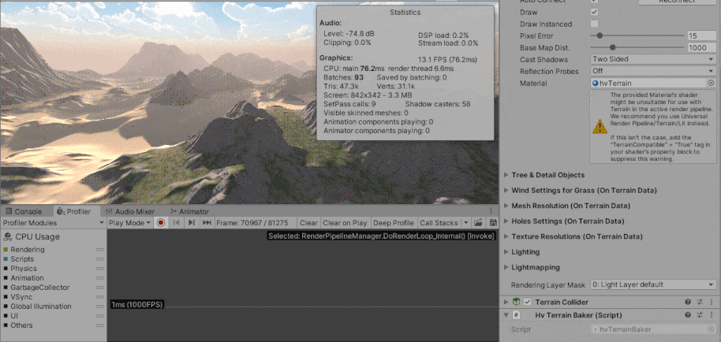
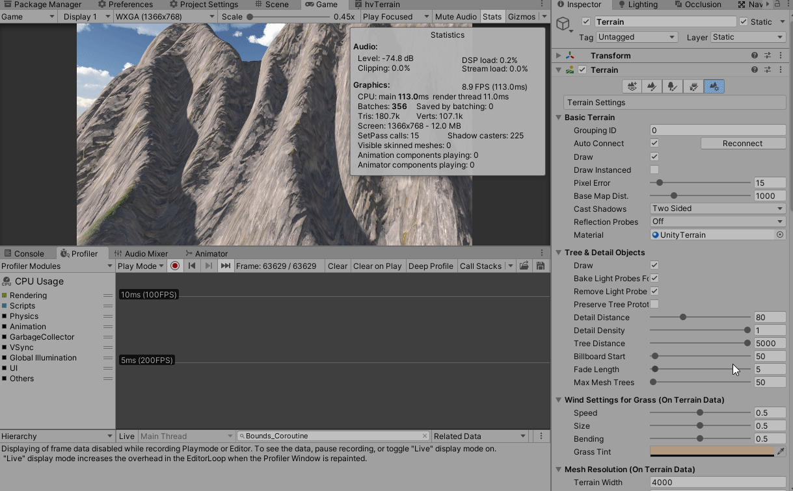

# What
hvTerrain is a terrain shader for URP I ended up making for my game. I got inspired by [KUF2](https://www.slideshare.net/drandom/angel-cunadothe-terrain-of-kuf2) terrain system (ps only, no clipmap stuff).

I got a lot of help from around the web, forums and gamedev communities in general, so I decided to release it under MIT.

Also, it's not production ready as I haven't tested it fully yet. Give it a try and tell me how it goes.

# Features
- Pros
    - up to 256 textures
    - triplanar
    - per pixel normals
    - holes support
    - *should be* more perfomant than Unity's Terrain
        - specially when using lots of textures
        - also, when NOT using triplanar
- Cons
    - no 'Draw Instanced' support (Shader graph issue I guess)
    - needs baking
    - layers blend not so smooth
    - use of Texture2DArray
        - it might not work on some old devices
        - it requires same-sized textures
        - no compression
        - also needs manual handling per Graphics API (so I was told, haven't tested on mobiles yet)

# Why
Because Unity's Terrain frag shader is slow, specially when you need lots of textures, as it relies on control maps (or alpha maps / splat maps). It means that every 4 textures the terrain has to 're-render'.

For example, lets say we have 16 layers (albedo + normals):
- 4 * [n of passes] draw calls per terrain patch
- 4 samples for control maps
- 16 albedo samples + 16 normal samples
- what if we want triplanar ?
    - then we get 3 * 32 + 4 = 100 samples per pixel
    - and most of the sampled textures don't even contribute

# How it works
It actually is more of a baking system than a shader. It works by baking Unity's Terrain data to textures.

Here is the rundown:
- Bakes Terrain layers to Texture2DArrays
    - currently only bakes albedo_smooth + normalsTS_rg
    - also bakes layer's normalScale and smoothness factors into textures
        - scaling normals to a texture might be bad a idea, need to test that more
    - bakes tile sizes to an array (_TexturesScale)
- Bakes SplatMaps to a texture called BlendMap0
    - blendMap0 channel layout = (id0, id1, weight, alpha)
        - alpha is a bitMask = [00000bxz] (applyBilinear isX isZ)
    - it supports blending up to 2 textures
    - axis is used for 'triplanar' (see KUF2 presentation)
    - ids need manual bilinear filtering on ps
- Bakes Terrain surface data (normals + triplanar axis blend zones) to BlendMap1
    - blendMap1 channel layout = (x, y, z, axisBlend)

With all that baked data we can have a more efficient sampling strategy:
- 5 for control map (BlendMap0 * 4 + BlendMap1) (we perform bilinear filter on BlendMap0)
- 4 * 2 albedo (id0 + id1)
- 4 normal (id0)
- triplanar uses branching condition on axisBlend areas (some hw benefit, some do not)
    - 4 * 2 * 3 albedo
    - 4 * 3 normal

# How to use
- Add hvTerrain component to a terrain gameobject
- Create a Unity Terrain material
- Create a hvTerrain material
- Assign materials to the hvTerrain component
- Create/Paint terrain as you normaly would
    - you can swtich materials by hvTerrain -> context menu -> switch material
    - you obviously should use Unity Terrain material while painting/sculpting for realtime preview
- Bake (hvTerrain -> contex menu -> bake)
- You can switch features on/off at the hvTerrain material
- Enabling/Disabling holes is a bit tricky
    - Make sure you enable 'Alpha Clipping' at shader graph + 'Holes' checkbox (also 'Terrain Holes' at the URPSettings asset)

# More Images

